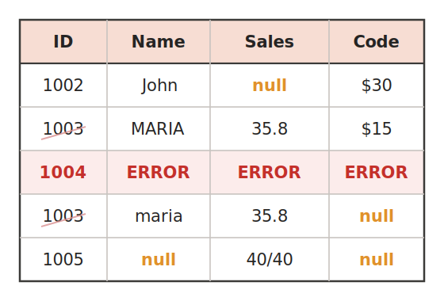
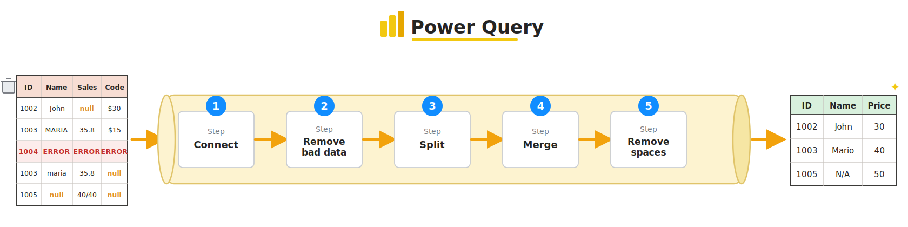

# Day 2 · Module 2 — Power Query & Power Pivot in Excel

**Morning · ~90 minutes**
*Topics: Get & Transform, merging/appending/reshaping, the Data Model, Power Pivot, and a financial dashboard case study*

> **This module is the hinge of the whole course.** Power Query and the Data Model are not really Excel features — they are the *Power BI engine*, shipped inside Excel. Learn them here and you have already learned half of this afternoon.

**📥 Practice files:** [Source data (all 7 CSVs, zip)](source_files.zip) · [Case study workbook](d2_m2_financial_dashboard_start.xlsx)

---

## Learn it

Real data almost never arrives clean. It looks like this:



*Blanks (`null`), an error row, a **duplicate** ID (`1003` twice), the same name in different cases (`MARIA` vs `maria`), and a broken value (`40/40`). Fixing this by hand every month is misery. **Power Query is how you fix it once and have the fix replay automatically** every time the data refreshes.*

### Why formulas are not enough

You can clean data with formulas. But next month the file arrives again and you do it all over.

**Power Query records your steps.** Clean the data once, and every future refresh replays those steps automatically. It is the difference between doing the work and *building the machine that does the work*.

It also handles volumes formulas cannot — millions of rows, dozens of files, without the workbook grinding to a halt.

### It's a pipeline (this is "ETL")

Power Query is an **ETL** tool — **E**xtract, **T**ransform, **L**oad. Messy data goes in one end, each thing you do is a numbered **step**, and clean data comes out the other:



- **Extract** = step 1, **Connect** to the source.
- **Transform** = the middle steps — remove bad rows, split columns, merge tables, trim spaces.
- **Load** = send the clean result to your sheet or the Data Model.

**Order matters.** The steps run **top to bottom**, each one working on the result of the one before — so you connect first and tidy last. Change the source data and the whole pipeline replays in the same order.

### Real-world alternatives

Power Query is the data-prep pipeline for **one analyst, solo or in a small team**. At enterprise scale the *same job* — clean, layered data, often a **Bronze → Silver → Gold** "medallion" pipeline — is built by a dedicated **data engineer** in a heavier tool like **Databricks**, then handed to Power BI for a whole data team:


You're learning the solo version — but the shape (**extract → clean in layers → load → visualise**) is exactly what the big tools do too.

### Where to find it

**Data** tab → **Get Data** (older versions: "Get & Transform"). Sources include Excel files, CSV, folders, databases, the web, JSON, and many more.

Choosing a source opens the **Power Query Editor**, a separate window. Nothing you do there touches your worksheet until you load it.

### The Editor

Four things on screen:

| Area | What it is |
|---|---|
| **Queries** (left) | Every query in the workbook |
| **Preview** (centre) | A sample of the data as it currently stands |
| **Applied Steps** (right) | **The most important panel** — every step you've taken, in order |
| **Ribbon** | Home / Transform / Add Column |

**Applied Steps is your undo history, your audit trail and your program.** Click any step to see the data as it was at that point. Delete a step with the `✕`. Reorder them by dragging. This is what makes the work repeatable — and reviewable.

Behind the scenes each step is a line of a language called **M**. You rarely write it by hand, but View → Advanced Editor will show you.

### The transformations that matter

**Cleaning:**

| Task | Where |
|---|---|
| Set data types | Click the column's type icon — **do this first, always** |
| Remove columns | Right-click → Remove |
| Remove duplicates | Home → Remove Rows → Remove Duplicates |
| Remove blank rows | Home → Remove Rows → Remove Blank Rows |
| Trim / clean whitespace | Transform → Format → Trim |
| Change case | Transform → Format → lowercase / Capitalize Each Word |
| Replace values | Right-click → Replace Values |
| Split a column | Home → Split Column → By Delimiter |

> **Set data types first, before anything else.** Almost every mysterious Power Query error traces back to a column Excel thinks is text when it should be a number or date. It is the single most common beginner mistake.

**Combining — and the two words people mix up:**

- **Append** = stacking rows. Same columns, more rows. *Jan + Feb + Mar → one long table.*
- **Merge** = joining columns. Matching on a key, bringing extra fields across. *Orders + Products → orders with product names.*

**Append** is Home → Append Queries. **Merge** is Home → Merge Queries, where you pick the two tables, the matching column in each, and a join type:

| Join | Keeps |
|---|---|
| **Left Outer** | Everything from the first table, matches from the second — *the default, and usually right* |
| Inner | Only rows that matched both sides |
| Full Outer | Everything from both |
| Anti | Only rows that **didn't** match — brilliant for finding broken keys |

> **Merge is `XLOOKUP` for whole tables.** Same job as Module 1, done once for a million rows instead of copied down a column. And "Left Anti Join" answers the question `XLOOKUP` can only hint at: *which of my orders have a product ID that doesn't exist in the product table?*

**Reshaping:**

- **Unpivot** — turns wide data into tall data. Columns `Jan | Feb | Mar` become rows with a Month column and a Value column. Select the columns → Transform → **Unpivot Columns**.
- **Pivot** — the reverse.
- **Group By** — summarise: total sales per category, count of orders per customer.

**Unpivot is the one to remember.** Humans like wide tables (a column per month). Every analysis tool — PivotTables, Power Pivot, Power BI — wants tall ones. Unpivot is how you convert a report-shaped spreadsheet into an analysis-shaped table, and you will use it constantly.

### Combining files from a folder

The best trick in Power Query. **Get Data → From File → From Folder** → point at a folder → **Combine & Transform**.

Power Query reads *every* file in the folder and appends them. Drop a new monthly file into the folder next month, click Refresh, and it is included. No formula edits, no copy-paste.

### Loading — and the option that matters

Home → **Close & Load To…** gives you choices:

| Option | Use when |
|---|---|
| Table | You want the data on a worksheet |
| **Only Create Connection** | It's a lookup table you'll merge — **don't clutter the workbook** |
| PivotTable Report | Straight to a pivot |
| **Add this data to the Data Model** | You want relationships and DAX — **tick this** |

Loading a lookup table to a sheet when you only need it for a merge is a common habit worth breaking. Connection Only keeps the workbook clean and fast.

### The Data Model and Power Pivot

The **Data Model** is a hidden in-memory database inside your workbook. It holds multiple tables and, crucially, the **relationships** between them.

Once tables are in the model you can **relate** them instead of looking values up. Power Pivot tab → **Manage** → **Diagram View** → drag the key field from one table to the matching field in the other.

That relationship replaces every lookup formula you would otherwise have written.

**Relationships have a direction and a cardinality.** Typically **one-to-many**: one product has many order lines. The "one" side is a **dimension** (Products, Customers, Dates); the "many" side is a **fact** (Orders, Sales). Getting this right is the heart of data modelling — and it is the whole of this afternoon's Module 6.

### DAX — yes, already

In Power Pivot you write **measures** in **DAX** (Data Analysis Expressions):

```
Total Revenue  := SUM(Orders[Sales])
Target         := SUM(Targets[Annual Target])
Variance       := [Total Revenue] - [Target]
Achievement %  := DIVIDE([Total Revenue], [Target])
```

It looks like Excel formulas, and the simple ones are. Two differences to note now:

1. **Measures reference columns, never cells.** `Orders[Sales]` means the whole column — there is no `H2`.
2. **A measure recalculates for whatever is being displayed.** Put it in a PivotTable with Category in Rows and each row computes its own total, automatically. Nothing is copied down.

`DIVIDE()` rather than `/` handles division by zero gracefully. Use it.

**This is the same DAX you will write in Power BI this afternoon.** Not similar — the same.

---

## See it — worked example

This module works from real files rather than a finished workbook, because Power Query is something you *do*.

Look in **`source_files/`**:

*(click a filename to download it, or grab them all with the [zip above](source_files.zip))*

| File | Purpose |
|---|---|
| [orders_2024.csv](source_files/orders_2024.csv) · [orders_2025.csv](source_files/orders_2025.csv) · [orders_2026.csv](source_files/orders_2026.csv) | 20 orders split by year — the **append** and **folder combine** exercise |
| [products.csv](source_files/products.csv) · [customers.csv](source_files/customers.csv) | Lookup tables — the **merge** exercise |
| [orders_messy.csv](source_files/orders_messy.csv) | Deliberately dirty — the **cleaning** exercise |
| [sales_by_month_wide.csv](source_files/sales_by_month_wide.csv) | Six month-columns — the **unpivot** exercise |

Open `orders_messy.csv` in a text editor first and see what you are up against — this is what real exported data looks like:

- **Duplicate rows** repeated verbatim
- **A completely blank row**
- Customer IDs with **leading/trailing spaces and inconsistent case** (`  c012 `)
- **Two different date formats** in one column (`17/01/2026` and `2025-11-30`)
- Sales stored as **text with a currency symbol** (`$ 1,000.00`)
- **Missing quantities**
- A `TechnicalLogID` column nobody needs

Every one of those is a real thing that arrives in real exports, and every one is a menu click in Power Query.

`d2_m2_financial_dashboard_start.xlsx` holds the category targets and a `Case Study Brief` sheet with the full step-by-step build.

---

## Do it — practice

### Exercise 1 — Clean (~20 min)

Import `orders_messy.csv` (Data → Get Data → From Text/CSV → **Transform Data**, *not* Load).

1. Set the data type of every column — do this first
2. Remove Blank Rows
3. Remove Duplicates
4. Trim and lowercase the `CustomerID` column
5. Remove the `TechnicalLogID` column
6. Fix the mixed date column (set type to Date; use Locale if a row resists)
7. Replace the errors in Sales, or set the type to Decimal Number
8. **Now look at the Applied Steps panel.** That list is your cleaning script. It will run again, identically, on next month's file.

### Exercise 2 — Append (~10 min)

Import all three `orders_20xx.csv` files, then Home → Append Queries → Three or more tables. 20 rows from three files.

**Then do it the better way:** delete those queries and use **From Folder** on `source_files`, filtering to just the `orders_20xx` files. Same result, and it picks up next year's file automatically.

### Exercise 3 — Merge (~15 min)

1. Import `products.csv` and `customers.csv` as **Only Create Connection**
2. On your appended Orders query: Merge Queries → `products.csv` → match on `SKU` → **Left Outer**
3. Expand the new column, selecting only `Product` and `Category`
4. Repeat for `customers.csv` on `CustomerID`, expanding `CustomerName` and `Country`
5. **Try a Left Anti Join** as an experiment — it should return no rows, proving every SKU has a match

### Exercise 4 — Unpivot (~10 min)

Import `sales_by_month_wide.csv`. Select the six month columns → Transform → **Unpivot Columns**. Eight wide rows become 48 tall ones. Rename the new columns to `Month` and `Sales`.

Compare the before and after. The tall version is the one every analysis tool wants.

### Exercise 5 — The dashboard case study (~35 min)

Open `d2_m2_financial_dashboard_start.xlsx` and follow the `Case Study Brief` sheet. You will combine the folder, clean, merge, load to the **Data Model**, relate to the Targets table, write four DAX measures, and build a PivotTable dashboard with a chart and a slicer.

**Finish with the refresh test:** add a row to `orders_2026.csv`, save it, then Data → **Refresh All** in Excel. The dashboard updates on its own.

That moment — new data appearing in a finished report with no manual work — is the entire point of this module.

### If you get stuck

| Problem | Why | Fix |
|---|---|---|
| Column full of `Error` | Wrong data type | Click the error cell to read the message; fix the type step |
| Dates won't convert | Mixed or non-local formats | Transform → Data Type → Using Locale |
| Merge returns blanks | Key mismatch — spaces or case | Trim and lowercase **both** key columns first |
| Row count doubled after merge | Duplicate keys in the lookup table | Remove Duplicates on the lookup's key column |
| Refresh fails | Source files moved | Data → Queries & Connections → edit the source path |
| Can't see the Power Pivot tab | Add-in disabled | File → Options → Add-ins → COM Add-ins → tick Microsoft Power Pivot |
| Relationship won't create | Data types differ, or neither side is unique | Match the types; the "one" side must have unique values |

---

## Check your understanding

1. In one sentence each: what is the difference between **append** and **merge**?
2. Why does the Applied Steps panel matter so much?
3. What should you always do first when a query opens?
4. When is "Only Create Connection" the right load option?
5. Why does every analysis tool prefer tall (unpivoted) data over wide?
6. What does a Left **Anti** Join find, and why is that useful?
7. Name two ways a DAX measure differs from an Excel formula.
8. What does From Folder give you that appending three files by hand does not?

---

## The bridge

Stop and take stock of what you just built:

**Source files → Power Query cleaning → Data Model with relationships → DAX measures → interactive dashboard with slicers.**

That is *exactly* the Power BI workflow. Same Power Query, same M language, same Data Model, same DAX. Power BI adds far better visuals, proper sharing, and scheduled refresh — but the engine underneath is the one you have just driven.

You are not about to start learning a new tool this afternoon. You are about to see a better front end for one you already know.

---

**Previous:** [Module 1 — Advanced Formulas](../01_advanced_formulas/LESSON.md) · **Next:** [Module 3 — Your First Power BI Dashboard](../03_first_dashboard/LESSON.md) · **Day 2 index:** [README](../README.md)


---

*© 2026 Global Academy. Prepared for the ZIMASCO (Kwekwe) workshop. Facilitated by Tapiwa Zireva. Licensed to participants for personal learning — not for redistribution, resale, or reuse in other training without permission.*
