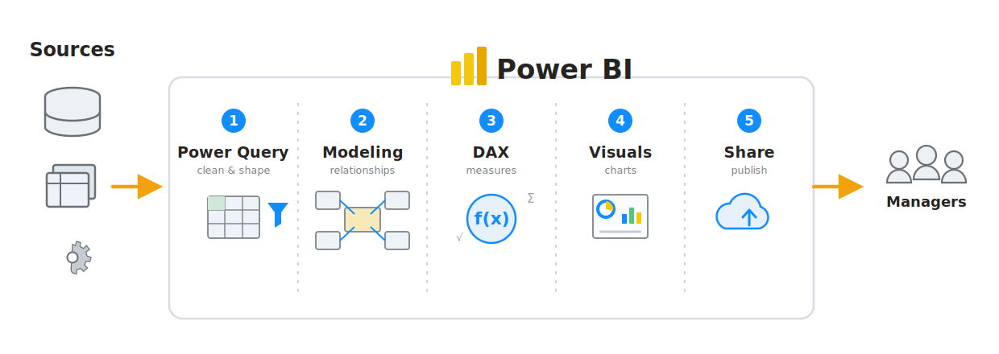

# Day 2 · Module 3 — The Power BI Ecosystem & Your First Dashboard

**Afternoon · ~60 minutes**
*Topics: Power BI Desktop / Service / Mobile, connecting Excel and CSV data, building your first report*

**Finished example:** `powerbi_files/day2_advanced_excel_and_power_bi/My First Dashboard.pbix`
**Data:** `customers.csv`, `orders.csv` (this folder)

---

## Learn it

### The big picture

*The five stages of Power BI. You build one per module across Days 2 and 3: **Power Query** (clean & shape — Modules 2 & 5) → **Modeling** (relationships — Module 6) → **DAX** (measures — Module 6) → **Visuals** (charts — Day 3 Module 1) → **Share** (publish — Day 3 Module 3). It starts by connecting to your **Sources** (Module 4) and ends with the report in front of **Managers**.*

### What Power BI actually is

Three products that share one name:

| Part | What it is | Cost |
|---|---|---|
| **Power BI Desktop** | A Windows application where you build reports | Free |
| **Power BI Service** | The website (`app.powerbi.com`) where you publish and share | Free to publish; sharing needs a licence |
| **Power BI Mobile** | Phone and tablet apps for viewing | Free |

**You build in Desktop, you share through the Service, people read on the web or Mobile.** That is the whole workflow, and we cover publishing properly on Day 3.

> **On a Mac?** Power BI Desktop is Windows-only. Options: a Windows VM (Parallels/UTM), Windows on Boot Camp, a cloud PC, or use the Power BI Service's browser-based editing — reduced, but enough to follow along. If none of these is available, work through the lesson by opening the provided `.pbix` files on a colleague's machine, and focus today on the Excel-side skills, which transfer directly.

### The three views in Desktop

Down the left-hand edge:

| Icon | View | What you do there |
|---|---|---|
| Chart | **Report** | Build visuals — the design canvas |
| Grid | **Table** (Data) | Inspect the actual loaded rows |
| Diagram | **Model** | Manage relationships between tables |

You will spend most of your time in Report view, but Model view is where the real thinking happens (Module 6).

### The screen in Report view

- **Canvas** (centre) — where visuals go
- **Visualizations pane** (right) — chart types on top, field wells beneath
- **Data pane** (far right) — your tables and columns
- **Filters pane** — filters at visual, page, or whole-report level

### Getting data in

**Home** → **Get Data**. Excel, CSV, SQL Server, web, SharePoint, JSON, and hundreds more.

Two buttons appear after you choose a file:

- **Load** — take it as-is
- **Transform Data** — open Power Query Editor first

> **Choose Transform Data almost every time.** It is the same Power Query Editor you used this morning — identical interface, identical Applied Steps panel, identical M language. Checking types and cleaning *before* loading saves a great deal of pain later.

That is the first big payoff of the morning: you already know how to use Power BI's data-loading engine.

### Building a visual

1. Tick a field in the Data pane — Power BI guesses a visual
2. Or click a visual type first, then drag fields into the wells beneath
3. Change type any time by clicking a different icon; the fields stay put

**The field wells** vary by visual, but the pattern is constant:

| Well | Holds | Excel equivalent |
|---|---|---|
| **Axis** / Rows | What you're grouping by | PivotTable Rows |
| **Values** | What's being measured | PivotTable Values |
| **Legend** | What splits into colours | PivotTable Columns |

**A Power BI visual is a PivotTable that draws itself.** If you can build a PivotTable — and after Day 1 you can — you can build a Power BI visual. The four zones map almost one-to-one.

### Aggregation

Drop a numeric field into Values and Power BI sums it by default. Click the dropdown on the field to switch to Average, Count, Minimum, Maximum, or Count (Distinct).

Numeric fields show a small Σ in the Data pane. If a number you expect to sum shows up as text instead, the data type is wrong — go back to Power Query.

### Cross-filtering — the thing Excel cannot do

Click a bar in one chart. **Every other visual on the page filters itself to match.**

Click "Laptop" in a category chart and your map, your trend line and your KPI cards all instantly show laptops only. Click it again to clear.

Nobody sets this up. It works because the visuals share a data model, and it is the single feature that makes a Power BI report feel alive compared with a static Excel dashboard.

### The core visuals

| Visual | Use for |
|---|---|
| **Card** | One big number — a KPI |
| **Clustered column / bar** | Comparing categories |
| **Line** | Change over time |
| **Table / Matrix** | Detail; Matrix ≈ a PivotTable |
| **Map** | Anything geographic |
| **Slicer** | On-canvas filter buttons — **exactly the Excel slicer from Day 1** |
| **Donut / Pie** | Part-to-whole, sparingly |

### Slicers

Insert a Slicer visual, drop a field into it, and you have clickable filter buttons — the same control, with the same name and behaviour, as the Excel slicer in Day 1 Module 8.

`Ctrl` + click selects multiple values. The Format pane switches a slicer between list, dropdown, and (for dates) a slider.

### Saving

Power BI Desktop files are **`.pbix`**. One file holds the data, the model, the measures and the report layout together.

---

## See it — worked example

Open **`powerbi_files/day2_advanced_excel_and_power_bi/My First Dashboard.pbix`**.

It is built on the two CSVs in this folder — the same NovaTech Retail orders and customers you worked with all through Day 1. The data is familiar; only the tool is new.

Work through it in this order:

**1. Table view.** Inspect `orders` and `customers`. Check the data types on the column headers — dates as dates, sales as decimals.

**2. Model view.** There is a relationship between `customers` and `orders` on `customer_id`. Hover over the connecting line: `1` at the customers end, `*` at the orders end — **one customer, many orders**.

That line is doing the job of an `XLOOKUP`. It was drawn once, and now *every* visual can show customer attributes against order measures without a single formula. Compare that with copying a lookup down 20 rows in this morning’s advanced-formulas module.

**3. Report view.** Look at how each visual is put together — click one and watch the Visualizations pane show which field sits in which well.

**4. Now interact.** Click a single bar in the category chart. Every other visual re-filters. Click a country in the map — the same. `Ctrl` + click to select two categories at once. Click a blank part of the canvas to clear.

That interactivity is free. It arrives with the model.

### Notes on the data

- `customers.csv` is **semicolon-delimited** — Power Query usually detects this, but check the preview and set the delimiter if the columns arrive mashed together
- `order_date` is **DD/MM/YYYY**. If dates land wrong, set the type using **Locale** → English (United Kingdom)
- Some customers have a **blank score** — normal, and worth noticing how Power BI handles blanks in aggregations

---

## Do it — practice

Build your own version from scratch — the fastest way to make this stick.

1. Open Power BI Desktop → **Get Data → Text/CSV** → `orders.csv` → **Transform Data**
2. Check every column's data type; fix `order_date` if needed (Locale: UK)
3. Close & Apply
4. Repeat for `customers.csv` (watch the semicolon delimiter)
5. **Model view:** drag `customer_id` from `customers` to `customer_id` on `orders`. Confirm it reads 1-to-many
6. **Report view — build five visuals:**
   - A **Card** showing total `sales`
   - A **Card** showing count of `order_id`
   - A **Clustered column chart**: `product_category` on Axis, `sales` in Values
   - A **Line chart**: `order_date` on Axis, `sales` in Values
   - A **Map**: `country` on Location, `sales` in Size
7. Add a **Slicer** on `product_category`
8. Give every visual a real title (Format pane → General → Title)
9. **Test the cross-filtering** — click a bar and watch everything respond
10. Save as `.pbix`

**Check yourself:** compare against `My First Dashboard.pbix`. Your totals should match; your layout will differ, and that's fine.

### If you get stuck

| Problem | Why | Fix |
|---|---|---|
| Columns all in one column | Wrong delimiter | Re-import; set delimiter to semicolon |
| Dates wrong or erroring | DD/MM/YYYY read as US format | Data Type → Date → **Using Locale** → English (UK) |
| Sales won't sum | Loaded as text | Change type to Decimal Number in Power Query |
| Visuals don't cross-filter | No relationship | Model view — create it |
| Map shows nothing | Location not recognised | Set the field's Data Category to Country |
| Numbers far too high | A many-to-many relationship, or a duplicated key | Check the relationship cardinality |

---

## Check your understanding

1. What are Desktop, Service and Mobile each for?
2. Why choose **Transform Data** over **Load**?
3. How do a Power BI visual's field wells map to a PivotTable's four zones?
4. What does cross-filtering do, and how much setup does it need?
5. A relationship between two tables replaces which Excel formula from Module 1?
6. What does the `1` and `*` on a relationship line mean?

---

**Previous:** [Module 2](../02_excel_power_query_and_power_pivot/LESSON.md) · **Next:** [Module 4 — Connecting to Different Data Sources](../04_connection_types/LESSON.md) · **Day 2 index:** [README](../README.md)

---

*© 2026 Global Academy. Prepared for the ZIMASCO (Kwekwe) workshop. Facilitated by Tapiwa Zireva. Licensed to participants for personal learning — not for redistribution, resale, or reuse in other training without permission.*
