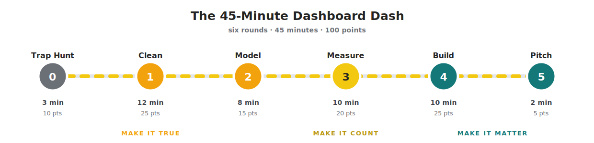

# Day 3 · Module 4 — Capstone: The 45-Minute Dashboard Dash

**Afternoon · 45 minutes · six rounds · 100 points**

**📥 Data file:** [novatech_capstone.xlsx](novatech_capstone.xlsx) — download this before you start



---

## The brief

It is Friday, 16:40. You are the analyst at **NovaTech Retail** — five branches, Harare to Bulawayo, the same business you have been working with since Day 1.

An email arrives from the Managing Director:

> *"The board pack says we grew last year. My branch managers say things feel worse. One of those is wrong and I'd like to know which before Monday. One page, please. Don't send me a spreadsheet."*

Attached is `novatech_capstone.xlsx` — the raw export from the point-of-sale and stock systems. Nobody has cleaned it.

**You have 45 minutes.** There is a real answer buried in this data — a specific, nameable thing that is going wrong, with a specific number attached. Your job is to find it and say it out loud in sixty seconds.

> **This is a revision exercise.** Every trap in the workbook and every step in every round is something you have already been taught. Nothing here is new. That is the point — this is where it all has to work together, at speed.

---

## What's in the workbook

Nine sheets. **Six belong in your model. Three do not.** Deciding which is which is Round 0.

| Sheet | Rows | What it is |
|---|---|---|
| `_INSTRUCTIONS` | — | The brief, in the file |
| `ORDERS_2025` | 135 | Order headers for 2025 — **15 columns** |
| `ORDERS_2026` | 135 | Order headers for 2026 — **13 columns** |
| `order_lines` | 578 | The detail: quantity, unit price, unit cost, discount, line total |
| `PRODUCTS` | 64 | The catalogue — and three rows that will hurt you |
| `branches` | 5 | Harare, Bulawayo, Gweru, Mutare, Kwekwe |
| `monthly_targets` | 24 | What the board expected, by month |
| `order_lines_BACKUP` | 578 | *Look at the name. Then look at the row count.* |
| `staff_contacts` | 20 | Four staff per branch |

**Ground rules**

- Everything is in **USD**.
- Work alone or in pairs. Keep the timer visible — the clock is part of the exercise.
- Each round has a **checkpoint** hidden behind a *"Check your numbers"* toggle. Do the work, **then** open it. Opening it first is only cheating yourself out of the one skill that matters most: knowing whether your own number is right.
- If a round overruns, take the checkpoint figure, move on, and lose the points. Finishing all six rounds badly teaches more than finishing two rounds perfectly.

---

## 🕵️ Round 0 — Trap Hunt · 3 minutes · 10 points

**Do not load anything yet.**

Open **Get Data → Excel workbook →** select the file → **Navigator**, and click through the nine sheets, reading the preview pane only. On paper, write down every problem you can see and what you would do about it.

**2 points for each trap you spot, up to 10.**

<details>
<summary><strong>⏱ Time's up — the traps</strong></summary>

1. **`order_lines_BACKUP` is a byte-for-byte copy of `order_lines`** — same 578 rows. Load both and every revenue figure doubles. Load one. *(Day 2 M5)*
2. **`ORDERS_2025` has 15 columns; `ORDERS_2026` has 13.** 2025 carries `LegacyRef` and `SourceFile`; 2026 has neither. Reconcile before appending or Power Query fills the gap with nulls. *(Day 2 M5)*
3. **`PRODUCTS` has `hash_key` and `source_id` columns** — system noise from the source system. Remove them. *(Day 2 M5)*
4. **`PRODUCTS` contains junk rows** — a `DO NOT USE` test product, and two rows whose `Category` is `SAP-099001` / `SAP-099002`. Those two repeat product names that already exist, and they will break your relationship in Round 2. *(Day 2 M5/M6)*
5. **`OrderDate` is a date *and a time*** — `2026-10-18 11:33:50`. Left as text or as datetime it will litter your date axis. *(Day 2 M3/M5)*
6. **`staff_contacts` has four rows per branch.** It is not a dimension. Leave it out. *(Day 2 M6)*
7. **`monthly_targets` is monthly; `order_lines` is per line.** Different grains — they cannot be related directly. *(Day 2 M6)*

Anything above five and you were reading properly. Most people miss the backup sheet, which is the one that would have done the most damage.

</details>

---

## 🧹 Round 1 — Clean · 12 minutes · 25 points

Load **six** sheets: `ORDERS_2025`, `ORDERS_2026`, `order_lines`, `PRODUCTS`, `branches`, `monthly_targets`.

Then, in Power Query:

| # | Do this | Pts |
|---|---|---|
| 1 | Remove `LegacyRef` and `SourceFile` from `ORDERS_2025`, then **Append** the two years into one `Orders` query | 5 |
| 2 | Set `OrderDate` to **Date** (not Date/Time) — the time of day is noise here | 3 |
| 3 | `PRODUCTS`: remove `hash_key` and `source_id`; filter out the `TEST` brand row and the two `SAP-0990…` rows | 5 |
| 4 | **Trim** `ProductName` in `order_lines` — two rows have stray spaces | 4 |
| 5 | Set every data type deliberately. Numbers as decimal, IDs as text | 3 |
| 6 | **Left Anti Join** `order_lines` against `PRODUCTS` on `ProductName` to find orphans — *before* you trust any total | 5 |

> **Why the anti join comes before anything else.** An orphan row still adds to your revenue total but vanishes from every breakdown by product or category. Your totals and your charts then disagree, and you find out in the meeting.

<details>
<summary><strong>✅ Check your numbers — Round 1</strong></summary>

| Checkpoint | Answer |
|---|---|
| `Orders` after append | **270 rows × 13 columns** |
| `order_lines` | **578 rows** |
| `PRODUCTS` after cleaning | **61 rows**, 61 distinct `ProductName` |
| Orphans, **before** trimming | **5 rows** |
| Orphans, **after** trimming | **3 rows** — `Aevo One 12`, `Lumio Pulse 6`, `Kestrel Router X1` |
| Revenue stranded on those 3 orphans | **$2,166.10** |

Those last three are genuinely discontinued products that no longer exist in the catalogue. The other two were only ever a space bar. Trim fixed them; nothing fixes the first three but a conversation with whoever maintains the product master.

If your appended `Orders` has 15 columns, you appended before removing — the extra two are full of nulls for 2026.

</details>

---

## ⭐ Round 2 — Model · 8 minutes · 15 points

| # | Do this | Pts |
|---|---|---|
| 1 | `PRODUCTS[ProductName]` **1 → ✱** `order_lines[ProductName]` | 3 |
| 2 | `Orders[OrderID]` **1 → ✱** `order_lines[OrderID]` | 3 |
| 3 | `branches[BranchID]` **1 → ✱** `Orders[BranchID]` | 2 |
| 4 | Build a date table, relate it to `Orders[OrderDate]`, and **Mark as date table** | 4 |
| 5 | Give `monthly_targets` a real date, and relate it | 3 |

**The date table** — new table, then:

```
Date =
ADDCOLUMNS(
    CALENDAR(DATE(2025,1,1), DATE(2026,12,31)),
    "Year",      YEAR([Date]),
    "Month",     MONTH([Date]),
    "MonthName", FORMAT([Date], "MMM"),
    "YearMonth", FORMAT([Date], "YYYY-MM")
)
```

**The targets** — `monthly_targets[Period]` is text like `2026-03`, so it will not join to anything. In Power Query, add a custom column:

```
TargetDate = Date.FromText([Period] & "-01")
```

Now relate `Date[Date]` **1 → ✱** `monthly_targets[TargetDate]`. Each month's target sits on the 1st of that month, so any month or year filter picks it up correctly — and the two tables never have to share a grain.

Finally: hide the key columns, and check the Model view for ambiguous paths.

<details>
<summary><strong>✅ Check your numbers — Round 2</strong></summary>

**Five tables, five relationships, every one one-to-many and single direction.** Filters flow `Date → Orders → order_lines` and `branches → Orders → order_lines`.

**If Power BI refused to make relationship 1 as one-to-many and offered you many-to-many instead, you skipped step 3 of Round 1.** `AEV-901` and `LUM-902` repeat the names `Aevo One 15` and `Lumio Boom Speaker`, so `ProductName` was not unique. Power BI will not tell you that you have a problem — it will quietly build you a relationship that produces wrong numbers. Go back, delete the junk rows, and the one-to-many appears.

That is the single most valuable thing in this round: **a relationship Power BI won't build is a dimension you haven't cleaned.**

</details>

---

## 🧮 Round 3 — Measure · 10 minutes · 20 points

Six measures, roughly 3 points each. Format them properly as you go — currency to 2 decimals, percentages to 1.

```
Total Revenue    = SUM(order_lines[LineTotal])
Total Cost       = SUMX(order_lines, order_lines[Quantity] * order_lines[UnitCost])
Gross Profit     = [Total Revenue] - [Total Cost]
Gross Margin %   = DIVIDE([Gross Profit], [Total Revenue])
Order Count      = DISTINCTCOUNT(order_lines[OrderID])
Revenue Target   = SUM(monthly_targets[TargetRevenue])
```

And two that make the numbers mean something:

```
Revenue LY       = CALCULATE([Total Revenue], SAMEPERIODLASTYEAR('Date'[Date]))
Achievement %    = DIVIDE([Total Revenue], [Revenue Target])
```

> **`SUMX`, not `SUM`.** `Total Cost` must multiply quantity by unit cost **row by row** and then add up. Write `SUM(Quantity) * SUM(UnitCost)` instead and you get **$312,383,281.20** — off by a factor of eight hundred, and margin nonsense along with it. If a number looks absurd, this is usually why.

Now put a matrix on the page — `Date[Year]` down the side, your measures across — and read it. Something in it should stop you.

<details>
<summary><strong>✅ Check your numbers — Round 3</strong></summary>

**Whole model, both years**

| Measure | Value |
|---|---|
| Total Revenue | **$487,289.50** |
| Total Cost | **$382,930.14** |
| Gross Profit | **$104,359.36** |
| Gross Margin % | **21.42%** |
| Order Count | **270** |
| Avg Order Value | **$1,804.78** |
| Revenue Target | **$519,200** |
| Achievement % | **93.9%** |

**By year — this is the moment the exercise turns**

| | 2025 | 2026 | Change |
|---|---|---|---|
| Revenue | $240,483.45 | $246,806.05 | **+2.6%** |
| Gross Profit | $55,707.52 | $48,651.84 | **−12.7%** |
| Gross Margin % | 23.16% | 19.71% | −3.45 pts |
| Achievement % | 97.0% | 91.0% | −6 pts |

**Revenue went up. Gross profit went down by an eighth.** The board pack and the branch managers are both right, and neither of them has noticed. Round 4 is about finding out why.

</details>

---

## 📊 Round 4 — Build · 10 minutes · 25 points

One page. **Three acts.** This is Module 2 made compulsory.


| # | Do this | Pts |
|---|---|---|
| 1 | **Act 1** — a KPI row: revenue, gross profit, margin %, achievement %. **Every card carries a comparison** (vs last year or vs target). A bare number scores zero | 6 |
| 2 | **Act 2** — one trend line over your date table. Revenue against target | 4 |
| 3 | **Act 3** — one **sorted** bar chart that names the cause. One colour, the outlier highlighted | 5 |
| 4 | **The title states the finding.** Not "Sales Overview." A sentence with a number in it | 5 |
| 5 | A **text box** on the page: What / Why / So what / **Now what** | 3 |
| 6 | Two slicers, no more. Alt text on every visual. Nothing overlapping | 2 |

**Where to look for the cause.** You know profit fell while revenue rose. Something is being sold at a worse margin than last year. Put `Gross Margin %` against **product category**, split by year — and then look at what changed underneath it. `DiscountPct` is sitting in `order_lines` waiting for you.

> **Four visuals is the maximum.** If you find yourself adding a fifth, you have stopped answering the MD's question and started showing your work. Detail goes on a drill-through page, not the front.

---

## 🎤 Round 5 — Pitch · 2 minutes · 5 points

Stand up. Sixty seconds. Out loud, even if you are alone — especially if you are alone.

| Seconds | Say |
|---|---|
| 0–10 | **The headline.** One sentence, with the number. |
| 10–25 | **The conflict.** What changed, and by how much. |
| 25–40 | **The cause.** One click — *one* — to show it. |
| 40–52 | **The recommendation.** What should happen, and by when. |
| 52–60 | **The caveat.** One honest limitation of this data. |

Do not narrate your Power Query steps. Nobody in that room cares how many merges it took.

**🏆 Bonus +10 — publish it.** *(Day 3 M3)* Publish to a real workspace (not My Workspace), set a scheduled refresh, turn on failure notifications, and open it as a Viewer. If you have no Power BI account, write the four-line deployment plan instead: workspace, audience and licences, refresh schedule, who gets the alert.

---

## 🏁 Score yourself

| Score | Verdict |
|---|---|
| **90–100** | You would have survived the meeting *and* the follow-up questions. |
| **70–89** | The MD gets a straight answer on Monday. This is a good result in 45 minutes. |
| **50–69** | The dashboard is right but doesn't argue. Reread Module 2 — it's the shortest one. |
| **Under 50** | Almost always the same cause: the cleaning was rushed, so nothing downstream could be trusted. Rounds 1 and 2 are worth 40 points for a reason. |

**The data rounds are worth 50 of the 100 points.** That is deliberate, and it reflects reality: a beautiful dashboard on a broken model is worse than no dashboard at all, because people believe it.

---

## 🔍 What the data was actually telling you

Open this **only after your pitch**.

<details>
<summary><strong>The answer</strong></summary>

**The headline.** Revenue grew 2.6% to $246,806.05 in 2026. Gross profit fell 12.7% to $48,651.84. The growth was bought, not earned.

**The cause — phones.** Phones are about 40% of the business. Every other category held its margin almost exactly:

| Category | GM% 2025 | GM% 2026 | Avg discount 2025 | Avg discount 2026 |
|---|---|---|---|---|
| **Phones** | **20.4%** | **10.6%** | **2.0%** | **12.8%** |
| Computers | 18.7% | 19.3% | 1.6% | 0.9% |
| Tablets | 23.1% | 23.6% | 1.2% | 0.5% |
| Smart Home | 33.9% | 34.0% | 1.7% | 1.5% |
| Audio | 37.3% | 37.5% | 1.1% | 0.8% |
| Accessories | 41.4% | 41.0% | 1.1% | 1.7% |

Phone gross profit fell from **$19,702.14 to $9,982.54** — a loss of **$9,719.60**. The rest of the business actually *gained* about $2,700. Net effect: the $7,055.68 the whole company lost is phones, and only phones. Discounting held the revenue line up and gave away the profit behind it.

**The second story, if you found it.** Branch revenue moved in opposite directions — Harare Central **+25.5%**, Mutare Eastgate **−33.8%**, Kwekwe Central −14.7%. Growth is coming from one branch while two shrink. Worth a second page, not the front one.

**The caveat you should have said out loud.** **April and September 2026 are missing from the export entirely** — no orders at all, though both months carry a target. The 91% achievement figure is therefore unfair to 2026, and any month-on-month trend has two holes in it. Saying this yourself, before someone else finds it, is the difference between an analyst people trust and one they check.

**A recommendation that would stand up:** cap phone discounts at 5% without manager approval, and review the Mutare branch — together they are worth more than the entire year's revenue growth.

</details>

> **📓 Full worked solution:** [SOLUTION_dash.md](SOLUTION_dash.md) — every click, formula and figure, round by round. **Open it only after your pitch.**

---

## 👹 Boss Level — optional, take-home

Want the full version? **[raw_tables.xlsx](raw_tables.xlsx)** is the same idea at four times the size: **23 sheets** of export data from a B2B distributor, roughly two hours of work, and a much harder judgement call about what to leave out.

The extra traps in it:

- A **duplicate sheet** hiding under the name `Sheet1`
- Category and subcategory **jammed into one pipe-delimited column**
- An `inventory` table in **wide format** — one column per month, needs unpivoting
- A **comma-separated SKU list** in a single cell
- Geography spread across **three sheets** that need merging into one dimension
- `customer_contacts` with **up to four rows per customer**
- Facts joined on **customer name rather than an ID**

**A good model uses eight to ten of the 23 sheets, not all of them.** Deciding what to exclude is the exercise. Weight your own effort the way the Dash does: cleaning and modelling first, visuals last.

**📦 Reference build:** [Project Clean Model.pbix](../../../powerbi_files/day3_visualizing_publishing_automating/Project%20Clean%20Model.pbix) — one worked solution. Try it yourself before opening it; comparing your model against a reference teaches far more than copying one. Yours will differ, and that's fine. What matters is that it's *deliberate* — that you can say why each table is in it and why each is out.

**📓 Step-by-step answer key:** [SOLUTION_boss.md](SOLUTION_boss.md) — the full seven-stage walkthrough with verified figures, to read alongside the reference build once you've had a go.

---

## Check your understanding

1. `order_lines_BACKUP` and `order_lines` are identical. What exactly happens to your revenue if you load both?
2. Power BI refuses to create a one-to-many relationship on `ProductName`. What does that tell you, and where do you go to fix it?
3. Why must `Total Cost` use `SUMX` rather than `SUM`?
4. `monthly_targets` is monthly and `order_lines` is per line. How did you make them comparable without faking a relationship?
5. Revenue rose and gross profit fell. Name the two measures you would put side by side to make that visible in one glance.
6. You have 60 seconds and one honest limitation to declare. Which one, and why does volunteering it help you?

---

## You've finished the course

Three days ago the starting point may have been "what is a cell". You have now taken a raw system export, cleaned it, modelled it into a star, measured it, and turned it into a one-page argument with a recommendation attached — in 45 minutes.

The tools will keep changing. The three things that won't:

1. **Clean data first.** Everything downstream inherits its problems.
2. **Model it properly.** A star schema of facts and dimensions, every time.
3. **Say what it means.** A number without a comparison and a recommendation changes nothing.

**Final homework:** [Extend and publish](../homework/HOMEWORK.md).

---

**Previous:** [Module 3](../03_publishing_and_sharing/LESSON.md) · **Day 3 index:** [README](../README.md) · **Course home:** [README](../../../README.md)


---

*© 2026 Global Academy. Prepared for the ZIMASCO (Kwekwe) workshop. Facilitated by Tapiwa Zireva. Licensed to participants for personal learning — not for redistribution, resale, or reuse in other training without permission.*
